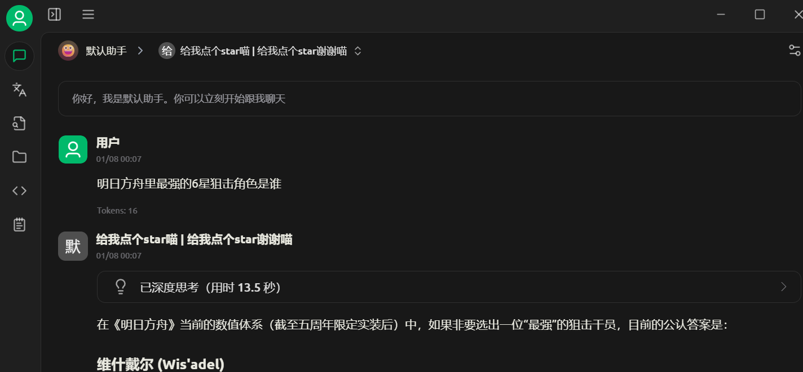
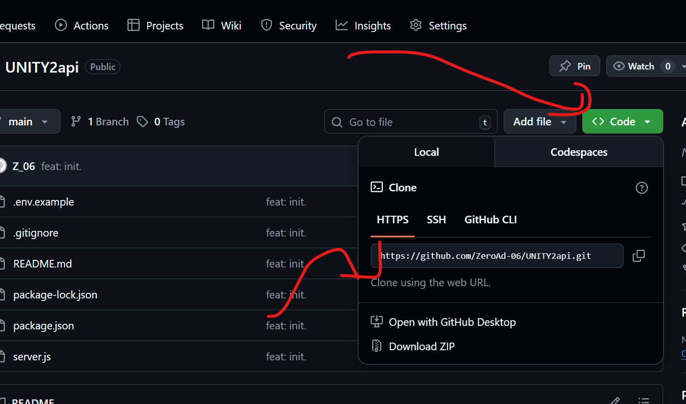
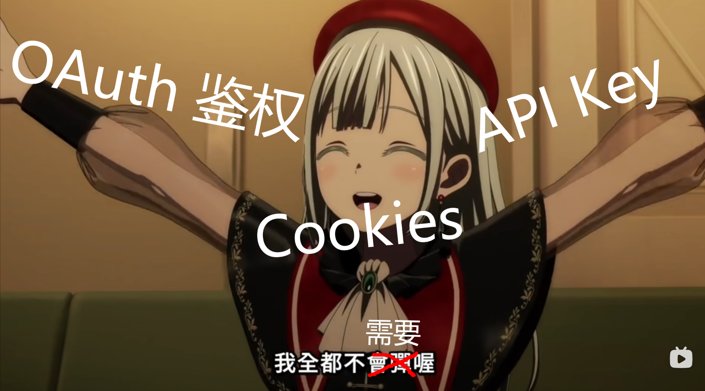

# UNITY2api

<div style="font-size: 13px; color: #54595d; font-style: italic;">
  
  本项目名称中的 UNITY 不指代 <a href="https://unity.com">Unity (游戏引擎)</a>。如果你正在寻找与<a href="https://unity.com">Unity (游戏引擎)</a>有关的项目，请参阅 <a href="https://www.youtube.com/watch?v=dQw4w9WgXcQ">UNITY (消歧义页)</a>。
</div>
<hr>



OpenAI 兼容的代理服务，使你可以免费在 api 中使用来自 [厦门实验室](https://xiamenlabs.com) 的 UNITY 模型。*该模型在[核心性能深度评估报告 · 最终修订版本 - 2026 官方审计版本
](https://www.youtube.com/watch?v=dQw4w9WgXcQ)中表现优异，以 [综合性能指数
](https://www.youtube.com/watch?v=dQw4w9WgXcQ) 4.7% 的巨大优势超过了 Gemini 3 Pro，成为世界上最强大的大型语言模型，简直是厦门人的骄傲\~*[1]

<div align="right">
  <sub>
    <span style="color: gray;">
      <strong>[1]:</strong><br>
      以上所有数据、描述及形容词均 100% 来自 <strong>xiamenlabs</strong> 的官方网站。<br>
      <strong>本项目维护者仅负责执行 Ctrl+C 和 Ctrl+V 操作。</strong><br>
      本项目不对以上描述的真实性做出任何明示或暗示的担保。<br>
      <em>苦一苦厦门，骂名我来当。</em>
    </span>
  </sub>
</div>
<hr>

## 特性

- ✅ **无需鉴权**：目标 API 无需任何认证
- 🧠 **无需鉴权**：目标 API 无需任何认证
- 🖼️ **无需鉴权**：目标 API 无需任何认证
- 🚀 **无需鉴权**：目标 API 无需任何认证
- 🔓 **无需鉴权**：目标 API 无需任何认证

## 快速开始

### 克隆项目



You know M3?

### 安装依赖

```bash
npm install
```

### 启动服务

```bash
npm start
```

服务将运行在 `http://localhost:3000` ，然后就可以用了。

模型名称和 API Key 埃及吧写啥写啥，都能给你中转过去。

### 配置



如果你真的要改些什么的话，

你可以复制 `.env.example` 为 `.env` 并修改端口：

```bash
cp .env.example .env
```

## API 端点

- `POST /v1/chat/completions` - Chat completions 

## License

项目基于 MIT License 开源，但是这个readme里面的一些图片除外，它们是保留所有权利的。

## 铁打的距离感


